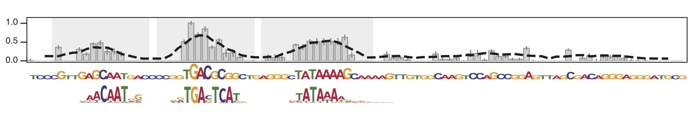

# MIND
#### Motif Identification by Nucleotide Deletion
An algorithm to find likely transcription factor (TF) binding sites in sequences using single-nucleotide deletions in massively parallel reporter assays

---------------------------------------------------------------------------------------------------
### Installation
MIND runs on Python 3 and uses a handful of packages:
- cython (0.26)
- matplotlib (2.0.2)
- numpy (1.13.1)
- pandas (0.20.3)
- seaborn (0.8)
- statsmodels (0.8.0)

You can either install these by hand using your favorite package manager or you can use [conda](https://conda.io/docs/user-guide/getting-started.html) to directly install the environment that I use to run MIND via the following command (after cloning or downloading this repository):
```
	cd utils
	conda env create -f environment.yml
	source activate mind
```

---------------------------------------------------------------------------------------------------
### Inputs
MIND requires the following files to run (more details below):
1. a file containing the list of motif position-weight matrices (PWMs) you wish to search for, in MEME format
2. file(s) containing MPRA deletion data
3. a file containing the paths to the MPRA deletion data files you wish to examine
4. (optional) a file containing a list of TFs you wish to subset your search to (e.g., a list containing only TFs that are expressed in the cell line in which you performed the MPRA)

#### PWM file
The PWM file needs to be in [MEME format](http://web.mit.edu/meme_v4.11.4/share/doc/meme-format.html), which end in .pfm. Something like:
```
MOTIF RUNX1	MA0002.2

letter-probability matrix: alength= 4 w= 11 nsites= 2000 E= 0
  0.143500	0.248000	0.348000	0.260500
  0.117000	0.242500	0.233500	0.407000
etc. etc.
```
The most important fields are the motif name (RUNX1 in the example above), as this is what will be referenced in all of the MIND outputs, and obviously the PWM itself (first 2 nucleotides shown here). If you have a PWM file that’s in a different format, you can use the [MEME suite](http://web.mit.edu/meme_v4.11.4/share/doc/motif_conversion.html) to convert it.

I’ve left the PWM file that I use in this repo at `inputs/0__pwm/pfm_vertebrates_meme_motifNameChanged.txt`, which contains 519 motifs from the JASPAR database.

#### Deletion files

The files containing the MPRA data itself must have the following columns with the following information:
- **delpos**: the deletion position number
- **seq**: the base at that position
- **mean.log2FC**: the mean log2 foldchange between the deletion tile activity and the reference tile activity
- **sd**: the standard deviation of that mean.log2FC number
- **se**: the standard error of that mean.log2FC number

They can also have the following optional columns:
- **tile_chr**: the chromosome corresponding to the reference sequence
- **tile_start**: the start position of the reference sequence, 0-based
- **tile_end**: the end position of the reference sequence, 0-based

I’ve left some of my example files in the `data/` directory for you to peruse. Just ignore any columns that I haven’t mentioned here, as you don’t need those to run MIND.

#### Paths file

You need to give MIND a file with a list of paths containing the deletion files (above) that you wish to analyze. It should have 2 tab-separated columns (NO HEADER): one with the paths and one with a shortened name that you’d like to use to refer to a given file.

Something like:
```
data/ZBTB37__p1__tile1.chr1:173837344-173837458.plus.av.log2FC.HepG2.new.txt	ZBTB37__p1__tile1__plus
```

I’ve left an example path file at `inputs/1__dels/deletion_files.txt`.

#### (optional) TFs file

If you want to subset your PWM to a smaller list of TFs (e.g., look at only TFs that are expressed in a given cell line), you can add an additional file that just has each TF you want to look at on a new line. Note that the TF names here must match the motif names mentioned in the PWM file section above.

I’ve left an example at `inputs/2__tfs/tfs.txt`, but remember this is optional.

---------------------------------------------------------------------------------------------------
### Running MIND
MIND requires the following arguments:
- --pwm_file (-p): path to the PWM file described above (file #1)
- --deletion_info_file (-d): path to the deletion info file described above (file #3)
- --seq_len (-l): length of the deletions tested in the MPRA
- --score_type (-t): must be either “loss” or “gain”: “loss” looks explicitly for deletions that lower activity (and therefore likely correspond to motifs of transcriptional activators), “gain” looks explicitly for deletions that increase activity (and therefore likely correspond to motifs of transcriptional repressors). most MPRAs are set up to look at “loss” scores, so this is probably what you want.
- --cores (-c): the number of cores to use. MIND is parallelized, so more cores = faster.
- --out_dir (-o): path to directory to store results

It also accepts the following optional arguments:
- --seed (-s): an integer number to use as a seed to numpy.random() (for reproducibility!) (default: 12345)
- --offset (-f): # of bp that the start number in deletion files is offset from 0 (default: 1)
- --bandwidth (-w): width to use in moving average smoother, needs to be an odd number (default: 5)
- --peak_cutoff (-k): cutoff to use when calling peaks (default: 0.5)
- --n_shuffles (-n): number of times to shuffle to create the null distribution (default: 1000)
- --tfs_expressed_file (-e): path to optional TF file described above (file #4)

You can run the MIND program using the data I’ve provided as follows:
```
	python mind.py -p inputs/0__pwm/pfm_vertebrates_meme_motifNameChanged.txt -d inputs/1__dels/deletion_files.txt -l 94 -t loss -c 4 -o results/test
```

